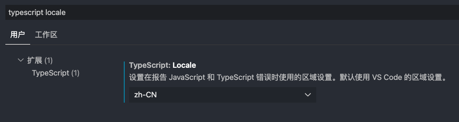

# TypeScript

## 关于TypeScript

TypeScript 是由微软开发的自由和开源的编程语言。它是JavaScript的超集，本质上是在JavaScript语言中添加了可选的静态类型和基于类的面向对象编程。
> TypeScript is JavaScript with syntax for types
> TypeScript是带有类型系统的JavaScript

### 为什么需要TypeScript

JavaScript是弱类型, 很多错误只有在运行时才会被发现，而TypeScript提供了一套静态检测机制, 可以帮助我们在编译时就发现错误。

#### 特点

1. 支持最新的JavaScript新特性
2. 支持代码静态检查
3. 支持其他语言中的特性 (枚举、泛型、类型转换、命名空间、声明文件、类、接口等)

### TypeScript的优势总结

1. 规避大量低级错误，避免时间浪费，省时
2. 减少多人协作项目的成本，大型项目友好，省力
3. 良好的代码提示，不用反复文件跳转或则翻文档，省心

### 安装TypeScript

TypeScript的命令行工具安装方法：
npm install -g typescript
以上为全局环境安装`tsc`命令，可以在任何地方执行`tsc`命令

编译TypeScript文件

```bash
tsc helloWorld.ts
# helloWorld.ts => helloWorld.js
```

编译后将会生成一份JavaScript

生成TypeScript配置文件

```bash
tsc --init
```

运行后，将会在当前目录生成一份`tsconfig.json`文。[配置详情](https://www.typescriptlang.org/tsconfig#files)

更多命令：

```bash
tsc -h  # 查看帮助信息
tsc -w  # 监听文件，有变动即编译
tsc -v  # 查看版本
tsc -p ./path/to/tsconfig.json  # 指定特定路径编译
```

这是一份TypeScript的配置文件，包含了官方初始化的一些配置以及注释，我们可以再次对它自定义的设置

### 尝试TypeScript

```ts
// helloWorld.ts
function sayHello(person: string) {
    return 'Hello, ' + person;
}

let user = 'Tom';
console.log(sayHello(user));
```

命令行执行

```bash
tsc helloWorld.ts
```

如果没有配置对应目录时，将会在当前目录生成`helloWorld.js`

```js
// helloWorld.js
function sayHello(person) {
    return 'Hello, ' + person;
}
var user = 'Tom';
console.log(sayHello(user));
```

### VsCode设置中文错误提示

通过设置搜索 `typescript locale` ，再将选项改成`zh-CN`



## 原始类型

### 数字（Number）

```ts
let decLiteral: number = 6;
let hexLiteral: number = 0xf00d;
// 二进制表示法
let binaryLiteral: number = 0b1010; // 10
// 八进制表示法
let octalLiteral: number = 0o744; // 484
let notANumber: number = NaN;
let infinityNumber = Infinity;

// 其中 0b1010 和 0o744 是 ES6 中的二进制和八进制表示法，它们会被编译为十进制数字。
```

### 字符串（String）

```ts
let myName: string = 'Tom';
let sentence: string = `Hello my name is ${myName}`
```

### 布尔类型（Boolean）

```ts
let bol: boolean = true
let bol2: boolean = Boolean(false)

// 注意: 由于new Boolean返回的是一个包装对象，因此类型是属于object
let bolError: boolean = new Boolean(true)  // error
```

### Symbol

由于默认配置已经`es6`以上版本，因此可以直接使用。如果低于该版本，将要在`lib`设置以上版本即可

```ts
const firstName = Symbol("name");
const secondName = Symbol("name");
 
if (firstName === secondName) {
// error: 此条件将始终返回 "false"，因为类型 "typeof firstName" 和 "typeof secondName" 没有重叠。ts(2367)
}
```

### BigInt

`BigInt` 类型在 `TypeScript3.2` 版本被内置，使用 `BigInt` 可以安全地存储和操作大整数，即使这个数已经超出了`JavaScript`构造函数 `Number` 能够表示的安全整数范围。

需要`tsconfig.json`的`lib`配置不得低于`es2020`版本

```ts
// 通过BigInt函数方法创建一个bigint
let oneHundred: bigint = BigInt(100);
 
// 通过字面量的方式创建一个bigint
let anotherHundred: bigint = 100n;
```

### 空值（Void）

表示没有任何类型，当一个函数没有返回值时，可以指定`void`

```ts
function sayHello(): void {
  console.log('Hello World')
}
```

变量的`void`，只有`undefined`才可以赋值给`void`。

由于默认配置`strictNullChecks : true`因此`null`无法赋值给`void`

```ts
let v: void = undefined  // ok
let v2: void = null // error
let v3: void = 5  // error
```

注意：在TypeScript中，`number` 类型虽然和`BigInt`都是有表示数字的意思，但是实际上两者类型是**不同**的

```ts
declare let foo: number;
declare let bar: bigint;

foo = bar; // error: Type 'bigint' is not assignable to type 'number'.
bar = foo; // error: Type 'number' is not assignable to type 'bigint'.
```

### Any（任意类型）

任意类型`any`表示允许赋值为任意类型

```ts
let message: sting = 'Hello World';
message = 2  // error


// any
let message: any = 'Hello World';
message = 3   // ok
```

任意类型可以调用任何属性与方法，与JavaScript原先写法一致，TypeScript将不会检查当前是否存在该属性与方法。出错将无法在编译阶段发现。

因此请尽量避免使用`any`。否则与不使用TypeScript没有任何区别

### Null 与 Undefined

由于默认配置`strictNullChecks : true`

在默认配置下`null`和`undefined`只能够赋值给自己类型或者`any`

```ts
let n: null = null
let u: undefined = undefined
let a: any = n || u
```

### 总结

TypeScript 中的原始类型

- 布尔类型：`boolean`
- 数字类型：`number`
- 字符串类型：`string`
- 空值：`void`
- Null 和 Undefined：`null` 和 `undefined`
- 任意类型：`any`
- Symbol 类型：`symbol`
- BigInt 大数整数类型：`bigint`

## 其他常用类型

以下作为其他类型的简单例子使用，更多需要点击进阶内容查看更多进阶方法

### 函数

常见的函数使用，都将要声明参数指定的类型，并且与返回值的类型

#### 参数类型声明

```ts
// ok
function greet(name: string) {
  console.log("Hello, " + name.toUpperCase() + "!!");
}

// error
function greet2(name: string) {
  console.log("Hello, " + name.toFixed() + "!!");
}
// Error： 属性“toFixed”在类型“string”上不存在。你是否指的是“fixed”?ts(2551)
```

参数声明指定类型时，TypeScript将会识别该值所具备的方法，当值不存在该方法时将会报错

#### 返回值类型声明

```ts
function greeter(fn: (a: string) => void): void {
  fn("Hello, World");
}
```

以上例子`fn`参数指定为一个带有`a`的`string`类型参数的函数类型，`:void`表示将没有返回值，或则返回其他类型，如下：

```ts
function getFavoriteNumber(): number {
  return 26;
}
```

#### 匿名函数

匿名函数与函数声明的方式会略有不同，当Typescript已经确定该如何调用它时，函数的参数会自动被赋予类型。也就是说，无需再声明类型，TypeScript也已经通过你调用的值来判断出来对应的类型

```ts
const names = ['Alice', 'Bob', 'Eve'];
names.forEach(function (s) {
  console.log(s.toLocaleUpperCase());
});
```

以上例子中，这里的`s`参数，在TypeScript已经非常清楚是一个`String`，因此可以不声明

以下为错误例子：

```ts
const users = [{name: 'Alice'}, {name: 'Bob'}, {name: 'Eve'}];
users.forEach( s => {
  console.log(s.toLocaleUpperCase());  // error
});

// Error：类型“{ name: string; }”上不存在属性“toLocaleUpperCase”。ts(2339)
```

TypeScript已经清楚`s`明确为一个对象时，由于对象不具备`toLocaleUpperCase`方法，因此编译出错

[**更多函数进阶**](#函数进阶)

### 对象类型

普通对象类型的声明方式与普通字面量定义对象的样子一致。当然一般使用中不会使用以下方式声明，更好的声明对象类型的方式是通过 [**接口（Interface）**](#接口与类型别名) 的方式声明

```ts
// ok
const positions: { x: number, y: number } = {
  x: 100,
  y: 200
}

// error
const positions2: { x: number, y: number } = {
  x: 100
}
// Error: 类型 "{ x: number; }" 中缺少属性 "y"，但类型 "{ x: number; y: number; }" 中需要该属性。ts(2741)

// error 当前声明的类型中，并没有z属性，因此出错
const positions3: { x: number, y: number } = {
  x: 100,
  y: 200,
  z: 10
}
```

当明确了类型所具备的值时，如果当前对象的值中属性少了或者多了，都将会出错

#### 函数参数对象类型声明

```ts
function printCoord(pt: { x: number; y: number }) {
  console.log("The coordinate's x value is " + pt.x);
  console.log("The coordinate's y value is " + pt.y);
}
printCoord({ x: 3, y: 7 }); // ok
printCoord({ x: 3}); // error
```

#### 可选属性

由于以上方式都是明确指定属性的方式声明类型的，属性一旦多或者少都将会出错。但是日常中我们的属性可能会是可选的方式，TypeScript也具备该功能，以下为可选属性的写法：

可选属性通过`属性?: 值`的方式来声明

```ts
function printName(obj: { first: string; last?: string }) {
  // ...
}
// ok
printName({ first: "Bob" });
printName({ first: "Alice", last: "Alisson" });

// error  当前声明的类型中，并没有middle属性，因此出错
printName({ first: "Alice", last: "Alisson", middle: 'Bob' }); 
```

但是在TypeScript中，如果访问可选参数时，由于该参数可能为`undefined`，因此会出。如下例子：

```ts
function printName(obj: { first: string; last?: string }) {
  // Error - 由于last值可能是undefined，因此不存在toUpperCase方法，所以出错
  console.log(obj.last.toUpperCase());

  // 解决方法：
  //ok: 1.通过类型断言明确值的类型
  console.log((obj.last as string).toUpperCase());

  // 2.通过条件判断是非undefined
  if (obj.last !== undefined) {
    // OK
    console.log(obj.last.toUpperCase());
  }
 
  //ok: 3.非空断言运算符：会自动判断last值是否存在，当不存在时不会调用toUpperCase方法
  console.log(obj.last?.toUpperCase());
}
```

- 给指定参数使用 [**类型断言**](#类型断言)
- 通过条件判断的方式
- 通过 [**非空断言运算符**](#非空断言运算符)
- 更多...

[**更多对象进阶**](#对象进阶)

### 数组（Array）

Todo...

### 元祖（Tuple）

Todo...

## 其他不常用类型

### unknown

Todo...

## 接口与类型别名

Todo...

## 类型额外使用方式

### 类型推断

如果没有明确的指定类型，TypeScript 会按照类型推断（Type Inference）的规则来推断出一个类型

```ts
let message = "Hello World!";
message = 1;
// error: 不能将类型“number”分配给类型“string”。ts(2322)

// 以上等价于
let message: string = "Hello World!";
```

如果在定义的时候没有赋值，不管之后有没有赋值操作，都会被推断成`any`类型而完全不被类型检查

```ts
let message;  // let message: any
message = 1;
message = 'Hello World'
```

### 联合类型

联合类型（Union Types）表示当前类型可以为多种类型中的其中一种。

联合类型使用 `|` 来分隔每个类型。

```ts
// ok
let AdditionalTypes: string | number;
AdditionalTypes = 'Hello World'
AdditionalTypes = 1

// error
AdditionalTypes = true
// error : 不能将类型“boolean”分配给类型“string | number”。ts(2322)
```

以上例子表示`AdditionalTypes`变量只限于定义`string`与`number`其中一种。赋值其他类型时将会出错

#### 访问属性和方法

当 TypeScript 不确定一个联合类型的变量到底是哪个类型的时候，我们**只能访问此联合类型的所有类型里共有的属性或方法**：

```ts
let AdditionalTypes: string | number;
AdditionalTypes = 'Hello World'
AdditionalTypes.length // 11
AdditionalTypes = 1
AdditionalTypes.length // Error
// error： 类型“number”上不存在属性“length”。ts(2339)
```

以上例子由于`number`类型并不存在`length`属性，因此达不到共有属性条件，因此出错

如果调用两者中共有的方法与属性时，将正常使用

```ts
// ok
function getString(value: string | number): string {
  return value.toString()
}
```

由于`string`与`number`类型的值都具备`toString`方法，因此正常使用

### 类型断言

Todo...

### 文本类型

Todo...

## 对象进阶

Todo...

## 函数进阶

Todo...

## 类

Todo...

## 资料参考与扩展进阶

- [TypeScript官方文档](https://www.typescriptlang.org/docs/handbook/intro.html)[【中文版】](https://zhongsp.gitbooks.io/typescript-handbook/content/)
- [TypeScript 入门教程](https://ts.xcatliu.com/)
- [一份不可多得的 TS 学习指南](https://juejin.cn/post/6872111128135073806#heading-45)
- [2021 typescript史上最强学习入门文章](https://juejin.cn/post/7018805943710253086#heading-125)
- [TypeScript实力测验](https://github.com/type-challenges/type-challenges)
- [TypeScript练习题](https://github.com/semlinker/awesome-typescript/issues)
