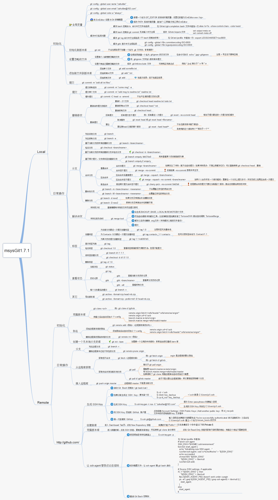

# Git 版本管理工具

## 初始化

### 使用前配置

```bash
git config --global user.name 'your_name'
git config --global user.email 'your_email@domain.com'
```

### config 更多作用

省略等同于`local`

```bash
git config --local   # 只对某个仓库有效（在某个仓库文件夹下使用）
git config --global  # 对当前用户所有仓库有效
git config --system  # 对系统所有登陆的用户有效
```

显示`config`配置方法： `--list`

```bash
git config --list --local
git config --list --global
git config --list --system
```

### 初始化git

通过使用`git init` 命令创建版本管理

##### 已有项目代码加入git管理

```bash
cd 项目所在文件夹
git init   # git初始化命令
```

#### 新项目直接使用git管理

通过在后面添加需要创建文件夹名称后，创建文件夹后自动加入git管理

```bash
git init your_project  # your_project为需要创建的文件夹名称
```

## 入门指南

#### 获取仓库

通过`clone`命令克隆仓库

```bash
git clone /path/to/repository   # 创建一个本地仓库的克隆版本
git clone username@host:/path/to/repository # 远端服务器上的仓库
```

#### 检查仓库状态

```bash
git status
```

#### 帮助

通过使用`help`查看特定**命令**帮助文档，使用`--web`通过浏览器打开

```bash
git help <命令> --web

# 例子
git help commit --web
```

::: warning
打开帮助文档功能出错处理 [help命令web文档无法打开](#help命令web文档无法打开)
:::

#### 基本用法


#### 添加和提交

使用`git add` 将文件添加到暂存区，`git commit`命令提交暂存区文件，使用`git help <add | commit> --web` 查看更多信息。

```bash
git add <filename>
git add *

git commit -m "代码提交信息"
```

#### 撤销

使用`git reset`实现撤销操作，使用`git help reset --web` 查看更多信息

```bash
git reset   # 当文件在暂存区时，使用reset撤销添加
git reset --soft HEAD^   # 撤消上一次提交
```

#### 分支

使用`git help <branch | checkout> --web` 查看更多信息。

```bash
git branch <分支名称> # 创建分支
git branch -v # 查看本地分支
git branch -a # 查看所有分支 (包括远程分支)
git checkout <分支名称>  # 切换分支
git checkout -b <分支名称>  # 创建并切换到该分支
git checkout -b <分支名称> <hash ｜ 分支名称> # 根据指定hash或分支，创建并切换该分支
git branch -d  <分支名称>   # 删除分支  -D 为强制删除
git push origin <分支名称>   # 分支推送到远程库
```

#### Log

`git log` 命令为查看本地仓库的历史记录，使用`git help log --web` 查看更多信息。

```bash
git log     # 默认 （只查看当前分支历史）
git log --oneline   # 更简洁的输出方式
git log -n<数字n>    # 查看最近n条记录
git log --oneline  -n2  # 简洁方式显示最新2条记录
git log --all  # 查看所有分支历史
git log --graph  # 显示分支线条

# 技巧
gitk  # 通过图形化打开版本历史界面
gitk --all # 显示所有分支

# 由于没有加上--global 默认是local，只针对本地git项目配置。
git config format.pretty oneline  显示历史记录时，每个提交的信息只显示一行
```

#### HEAD

## 🙌🏼 实战技巧

<details open>

<summary>目录</summary>

- [文件重命名](#文件重命名)
- [多行提交信息](#多行提交信息)
- [临时分支实践](#临时分支实践)

</details>

### 更改文件名

场景：将已在git管理的文件进行重命名。通过`git mv`直接对文件进行重命名，减少`删除/新增`步骤

```bash
git mv <原文件名称> <更改后的文件名称>
```

### 多行提交信息

场景：想要提交信息显示更多内容，描述更多信息时，因此我们需要多行提交信息来表示。

由于常见的提交规范引用：[git提交规范](https://www.conventionalcommits.org/zh-hans/v1.0.0/)

当我们想要提交以下信息时：

```txt
fix: prevent racing of requests

Introduce a request id and a reference to latest request. Dismiss
incoming responses other than from latest request.

Remove timeouts which were used to mitigate the racing issue but are
obsolete now.

Reviewed-by: Z
Refs: #123
```

通过使用**换行符**`mac: ⌥ + 回车`空出一行的方式来编辑出来

```bash
git commit -m 'fix: prevent raching of requests 

Introduce a request id and a reference to latest request. Dismiss
incoming responses other than from latest request. 

Remove timeouts which were used to mitigate the racing issue but are
obsolete now.

Reviewed-by: Z
Refs: #123'
```

#### Git log

```txt
commit 0d290ad2a88887ba8e8ce2b21e5c30221bbd709e (HEAD -> master)
Author: mutoumiao <22@qq.com>
Date:   Fri Apr 1 20:57:05 2021 +0800

    fix: prevent raching of requests
    
    Introduce a request id and a reference to latest request. Dismiss
    incoming responses other than from latest request.
    
    Remove timeouts which were used to mitigate the racing issue but are
    obsolete now.
    
    Reviewed-by: Z
    Refs: #123
```

### 分离头指针

分离头指针比如当使用`git checkout <hash>`命令创建一个临时分支（类似）时，**HEAD**指向`commit`记录并没有与分支或tag等挂钩。因此类似创建一个临时分支空间。

⚠️注意：**当切换到已有真实分支时，那么临时分支就不复存在并会被Git清除**

```bash
git checkout 0d290ad  # 创建临时分支
git branch -av        # 查看当前分支列表

# * (HEAD detached at 0d290ad) 0d290ad commit message
#  master                     0d290ad commit message
# (END)

# 如果在临时分支再次切换回真实分支时
git checkout master
git branch -av

# * master   0d290ad commit message
#(END)
```

#### 优点

由于分离头指针是类似临时分支一样。**因此可以利用该特性做一些实验性的操作**，这种实验性操作是不受任何影响，并且也不担心丢失等等。

#### 解决方法

当已经在分离头指针提交记录后，突然不小心切换回真实分支时，想要挽留之前的提交内容，请根据以下操作：

```bash
# 以下为操作例子
git checkout 0d290ad
touch update.txt   # 这里创建一个文件
git add update.txt
git commit -m 'add update.txt'

git log --oneline
# 6dec045 (HEAD) add update.txt
# 0d290ad (master) commit message
# (END)

```

当你处在临时分支，并突然误操作切换到真实的分支时，解决方法：

```bash
git checkout master # 此为误操作，直接切换回master
# Warning: you are leaving 1 commit behind, not connected to
# any of your branches:

#   6dec045 add update.txt

# If you want to keep it by creating a new branch, this may be a good time
# to do so with:

#  git branch <new-branch-name> 6dec045

# Switched to branch 'master'
```

根据以上提示查看，因此你可以通过`git branch <新分支名称> <临时分支提交hash>` 挽回损失

## 踩坑问题

<details open>

<summary>目录</summary>

- [help命令web文档无法打开](#help命令web文档无法打开)

</details>

### help命令web文档无法打开

当使用 `git help --web log` 参数想通过浏览器方式打开本地文档时，出现以下提示：

```bash
fatal: ‘/usr/local/git/share/doc/git-doc’: not a documentation directory.
```

::: tip
注意：以下方法已通过`macos`实践
:::

```bash
# 创建用来保存Git HTML文档目录
sudo mkdir -p /usr/local/git/share/doc

# 进入目录
cd /usr/local/git/share/doc

# 克隆文档文件
sudo git clone git://git.kernel.org/pub/scm/git/git-htmldocs.git git-doc 

# 将你的Git 文档目录明确指向一个新的文档目录
git config --global help.htmlpath /usr/local/git/share/doc/git-doc

# 告诉 Git 默认使用 html 格式的帮助文档
git config --global help.format html
```

## 操作脑图



## 更多文章

- [git-recipes Git的教程](https://github.com/geeeeeeeeek/git-recipes)
- [Git 的奇技淫巧](https://github.com/521xueweihan/git-tips)
- [git提交规范](https://www.conventionalcommits.org/zh-hans/v1.0.0/)
- [git 简明指南](https://www.html.cn/doc/git-guide/)
- [学习Git分支](https://learngitbranching.js.org/?demo=&locale=zh_CN)
- [图解Git](http://marklodato.github.io/visual-git-guide/index-zh-cn.html#basic-usage)
