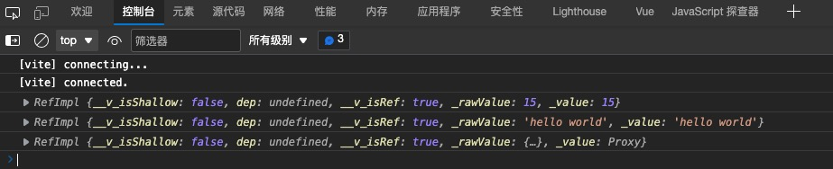
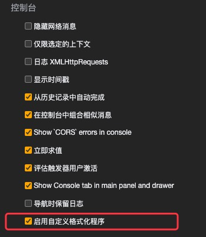
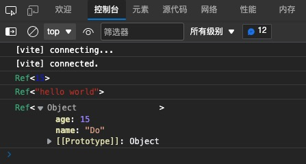

# Vue3 设计与实现笔记

## 框架设计

### Tree-Shaking

## 原理入门代码

### 迷你`Render`函数实现

```ts
interface vNode {
  tag: string
  children: string | Array<vNode>
}

const obj = {
  tag: 'div',
  children: [
    {
      tag: 'span',
      children: 'hello world',
    },
  ],
}

function render(obj: vNode, root: HTMLElement) {
  const el: HTMLElement = document.createElement(obj.tag)

  if (typeof obj.children === 'string') {
    const text = document.createTextNode(obj.children)
    el.appendChild(text)
  } else if (obj.children) {
    obj.children.forEach((child) => render(child, el))
  }

  root.appendChild(el)
}

render(obj, document.body)

```

## 使用技巧

### Console设置

#### 解决Vue ref 数据在控制台不容易预览问题

在日常开发中，当想通过`console.log`打印数据查看时，在控制台显示的格式很难一目了然的看到真正希望预览的数据

```ts
interface User {
  name: string
  age: number
}

const count: Ref<number> = ref(15)
const message: Ref<string> = ref('hello world')
const user: Ref<User> = ref({ name: 'Do', age: count.value })

// console
console.log(count)
console.log(message)
console.log(user)

```

实际浏览器控制器显示效果



解决方法，如图所示

通过设置开发者工具-设置-控制台-启动自定义格式程序



最终效果



### 错误处理

提供统一的处理接口

```ts
// core.ts
interface AppConfig {
  // ...
  errorHandler?: (err: unknown) => void
}

export const app: AppConfig = {}
```

```ts
// utils.ts
export default {
  foo(instance /* AppConfig */, fn: Function): void {
    callWithErrorHandling(instance, fn)
  },
  bar(instance /* AppConfig */, fn: Function): void {
    callWithErrorHandling(instance, fn)
  },
}
// 通过callWithErrorHandling统一处理错误机制
function callWithErrorHandling(instance, fn: Function): void {
  try {
    fn && fn()
  } catch (err) {
    handleError(err, instance)
  }
}

// 判断如果注册了errorHandler事件，将捕获到的错误传递给用户错误处理程序
function handleError(err: unknown, instance /* AppConfig */): void {
  const appErrorHandler = instance.errorHandler
  if (typeof appErrorHandler === 'function' ) {
    appErrorHandler(err)
  }
}
```

```ts
import { app } from 'core.js'
import utils from 'utils.js'
// 注册出错处理
app.errorHandler = (error)=> {
  console.log(error)
}

utils.foo(app, ()=> {/*...*/})
utils.bar(app, ()=> {/*...*/})
```
