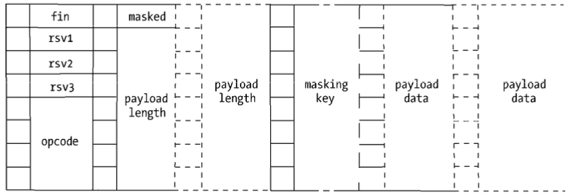

# Websocket

[Websocket](https://developer.mozilla.org/zh-CN/docs/Web/API/WebSocket) 是在HTML5所新增的一个通信功能，它定义了一个全双工通信（服务器和客户端双向通信功能）

**特点：**

- WebSocket就很好的解决被动性问题，只需要完成一次握手，两者之间就直接可以创建持久性的连接，并进行双向数据传输。不用再次发起网络请求,服务端有消息就会自己发过来.它允许服务端主动向客户端推送数据。比如在app上websocket获取并展示客户的时时消费情况.
- WebSocket同HTTP一样也是应用层的协议. 都是基于TCP的传输协议。但是它是一种双向通信协议，是建立在TCP之上的，并且Websocket是一个持久化的协议，而HTTP是非持久化的协议。WebSocket是一种新的协议，但Websocket是基于HTTP协议的，或者说借用了HTTP的协议来完成一部分握手。一开始的握手需要借助HTTP请求完成
- WebSocket在建立握手时，通过 HTTP/1.1 协议的请求进行握手。但是建立之后，在真正传输时候是不需要HTTP协议的，因为在握手时就已经将HTTP协议升级倒了WebSocket协议
- Websocket使用ws或wss的统一资源标志符，类似于HTTPS，其中wss表示在TLS之上的Websocket
- Websocket使用和 HTTP 相同的 TCP 端- ，可以绕过大多数防火墙的限制。默认情况下，Websocket协议使用80端- ；运行在TLS之上时，默认使用443端-
- 优点：实时性更强，很好的控制开销(协议的头部较小)，保持连接

## 在WebSocket之前如何实现实时通信？

- Adobe Flash Socket
- Iframe及htmlfile的流/长连接（streaming)
- Ajax 轮询/短轮询（Polling)
- Ajax 长轮询（long-polling)
- Server-Sent Events （SSE）

### Adobe Flash Socket

通过在页面嵌入一个使用了Socket类的Flash程序，再通过Javascript方法调用程序所提供的Socket接- 与服务端的Socket接- 进行通信。

优点：可完整实现实时的通信需求
缺点：客户端必须安装Flash插件，加上Flash已淘汰

### Iframe及htmlfile的流/长连接（streaming)

通过在HTML页面里陷入一个隐藏的`iframe`，然后将这个`iframe`的`src`属性设为对一个长连接的请求，服务器端就能源源不断地往客户推送数据。

优点：消息即时到达
缺点：服务器维护一个长连接会增加开销。IE、Morzilla Firefox 下端的进度栏都会显示加载没有完成，而且 IE 上方的图标会不停的转动，表示加载正在进行。

备注：在IE中可以通过 `ActiveXObject` 对象解决了在 IE 中的加载显示问题。

### Ajax 轮询/短轮询（Polling)

通过设置定时器的方式，每间隔不停向服务器发出请求，已频繁请求的方式来保持客户端与服务器的同步。

优点：简单粗暴
缺点：由于频繁请求原因，在一定时间也没有新消息时，增加无法想象的无用请求，浪费资源。

### Ajax 长轮询（long-polling)

和短轮询一样，但是不同之处在于这是一个类似异步请求，当请求时会保持与服务器连接状态（短时间内，不是长时间保持）。即 readystate 为 3 时（数据仍在传输中），当服务端来时会立即响应该请求。

优点：在没有消息的情况下不会频繁请求，节省资源（如果数据量大时，与短轮询没有明显的改善）
缺点：由于浏览器对请求数有限制，而长轮询的方式会在一定时间内占用请求数。服务器端没有数据保持连接也会消耗资源，需要同同时维护多个线程（类似Apache 每个连接就是一个线程。Node 则是所有连接都使用同一个线程，因此消耗的资源会小得多）

### Server-Sent Events （SSE）

服务端向浏览器推送消息方法，比起WebSocket是全双工通道，可以双向通信。SSE 是单向通道。[SSE详情介绍](https://www.ruanyifeng.com/blog/2017/05/server-sent_events.html)

## 使用

### 客户端的使用示例

```javascript
const ws = new WebSocket('ws://localhost:3030/', 'parameter');
ws.addEventListener('open', () => {
  console.log('创建websocket连接');
});

ws.addEventListener('message', (response) => {
  console.log('接收到的数据', response.data);
});

ws.addEventListener('close', () => {
  console.log('连接已关闭');
});

ws.addEventListener('error', () => {
  console.log('websocket 连接出错');
});  
```

### 服务端的使用示例

常用的 Node 实现有以下三种。

- [uWebSockets](https://github.com/uNetworking/uWebSockets)
- [Socket.IO](https://socket.io/)
- [WebSocket-Node](https://github.com/theturtle32/WebSocket-Node)

以上为生产环境推荐使用第三方封装好的工具

---

**原理步骤：**

1.正在调用客户端API建立连接时，会通过HTTP发起请求报文，如下面所示：

```http
GET /chat HTTP/1.1 
Host: example.com
Upgrade: websocket
Connection: Upgrade
Sec-WebSocket-Key: 1T80Q3fFGLFuXQXZ5ZZPFA==
Sec-WebSocket-Version: 13
<!-- 可选 -->
Origin: http://example.com
Sec-WebSocket-Protocol: protocol [,protocol]*
Sec-WebSocket-Extensions: extension [,extension]*
Cookie: Cookie content & other cookie-related headers
```

2.该请求会因为两个字段 `Upgrade: websocket`, `Connection: Upgrade` 表示请求服务器升级协议为WebSocket。其中`Sec-WebSocket-Key`用于安全校验
> `Sec-WebSocket-Key`的值是随机生成的`Base64`编码的字符串

3.服务器接收到之后，将它与guid`258EAFA5-E914-47DA-95CA-C5AB0DC85B11`相连，形成以下字符串：

```http
1T80Q3fFGLFuXQXZ5ZZPFA==258EAFA5-E914-47DA-95CA-C5AB0DC85B11
```

4.然后再通过`sha1`安全散列算法计算出结果后，再进行`Base64`编码，最后返回给客户端，如下面所示：

```http
HTTP/1.1 101 Switching Protocols
Upgrade: websocket
Connection: Upgrade
Sec-WebSocket-Accept: HqQ3b+Y0FYRnM9OeN6f/eSntCAI=
<!-- 可选 -->
Sec-WebSocket-Protocol: protocol
Sec-WebSocket-Extensions: extension [,extension]*
```

5.当握手成功后，连接将会升级为WebSocket的传输协议，并通过数据帧的方式进行服务器与客户端之间的数据传输
> 为了安全考虑，客户端需要对发送的数据帧进行掩码（`Mask`）处理，服务器一旦收到无掩码帧（中间拦截破坏），连接将会关闭。而服务器发送到客户端的数据帧并不需要做掩码处理，同样，如果客户端收到带有掩码的数据帧，连接也会关闭。

**数据帧的定义：**

每一列代表一个字节，一个字节8位，每一位又代表一个二进制数


- `fin`：当数据帧是最后一帧时将为`1`，其余情况都为`0`。当这个数据没有分为多帧时，它将是第一帧也是最后一帧。
- `rsv1`、 `ISv2`、`rsv3`：各为1位长，3个标识用于扩展，当有已协商的扩展时，这些值可能为`1`，其余情况为`0`。
- `opcode`：长为4位的操作码，可以用来表示0到15的值，用于解释当前数据帧是什么。

  ```h
  0：表示一个继续帧
  1：表示文本数据帧
  2：表示二进制数据帧
  8：表示发送一个连接关闭的数据帧
  9：表示ping数据帧
  10：表示pong数据帧
  // 其余值暂时没有定义
  // ping数据帧和pong数据帧用于心跳检测，当一端发送ping数据帧时，另一端必须发送pong数据帧作为响应，告知对方这一端仍然处于响应状态。
  ```

- `masked`：表示是否进行掩码处理，长度为1。客户端发送给服务器端时为`1`，服务器端发送
给客户端时为`0`。
- `payload length`：一个7、7+16或7+64位长的数据位，标识数据的长度。

  ```h
  0~125位之间：数据payload的真实长度；
  126位：后面16位的值是数据payload的真实长度；
  127位：后面64位的值是数据payload的真实长度。
  ```
  
- `masking key`：当`masked`为`1`时存在，是一个32位长的数据位，用于解密数据。
- `payload data`：我们需要的数据，如果`masked`为`1`，该数据会被加密，要通过`masking key`进行异或运算解密才能获取到真实数据。

---

[代码实现Demo](https://github.com/Mutoumiao/Blog/tree/master/demos/Websocket)
